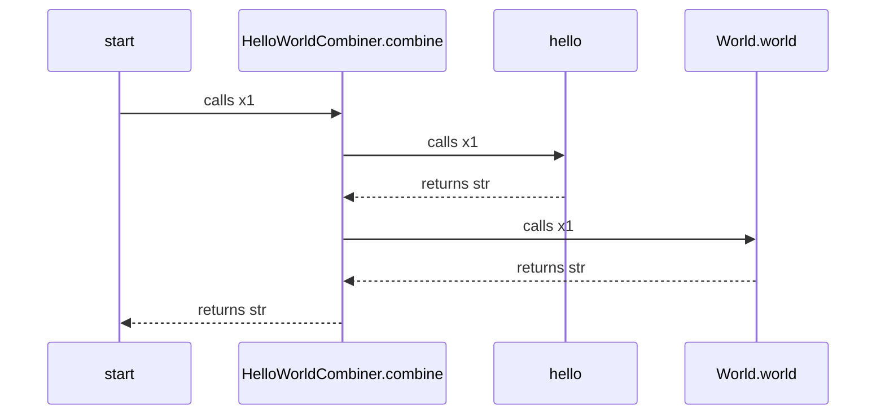
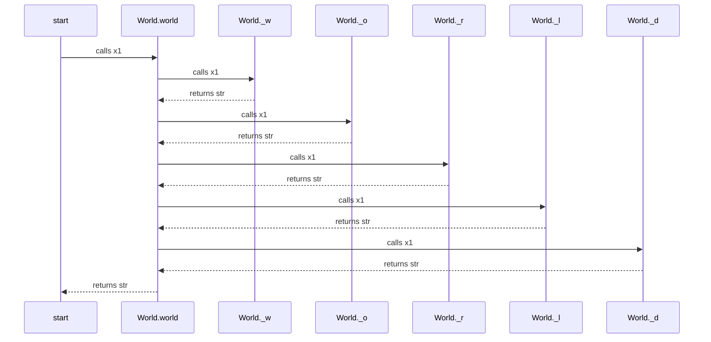

# Example usage of "docs-from-tests" package

This is a demonstration repo, showing how to use the [docs-from-tests python package](https://github.com/ceddlyburge/docs-from-tests). More background on why should want to do this are in the [How to Create Documentation from Your Python Tests](https://www.freecodecamp.org/news/how-to-create-documentation-from-your-python-tests/) blog post.

The package contains functions to instrument your code / tests to create a sequence diagram (in markdown / [mermaid](https://mermaid-js.github.io/mermaid/)) as the tests run. The sequence diagrams show the runtime call hierachy of the code, and are saved as files in the repository, which are checked in. You can choose to ignore specific functions, and private functions, to make the diagram readable in each context you are interested in.

The diagrams are useful documentation, and will stay up to date as they are automatically generated. Hopefully it will encourage us to have useful diagrams in the repo, with the appropriate levels of detail, which in turn will encourage us to structure the code well so it produces good diagrams, and to have tests at these levels of detail.

## Build Status

## Example Usage

You can see an example of generating documentation from tests at [tests\test_hello_world.py](tests\test_hello_world.py)

There is an end to end test, and a unit test, and they produce the documentation / graphs below

- [doc/end-to-end-sequence-diagram.md](doc/end-to-end-sequence-diagram.md)
- [doc/world-sequence-diagram.md](doc/world-sequence-diagram.md)

The graphs are reproduced here for convenience. They are mermaid diagrams, you may need to install a [Browser Plugin](https://github.com/BackMarket/github-mermaid-extension) or [VsCode extension](https://marketplace.visualstudio.com/items?itemName=bierner.markdown-mermaid) or similar to view them.

### End to end

[View full screen as an SVG](https://mermaid.ink/svg/c2VxdWVuY2VEaWFncmFtCiAgc3RhcnQtPj5IZWxsb1dvcmxkQ29tYmluZXIuY29tYmluZTogY2FsbHMgeDEKICBIZWxsb1dvcmxkQ29tYmluZXIuY29tYmluZS0+PmhlbGxvOiBjYWxscyB4MQogIGhlbGxvLS0+PkhlbGxvV29ybGRDb21iaW5lci5jb21iaW5lOiByZXR1cm5zIHN0cgogIEhlbGxvV29ybGRDb21iaW5lci5jb21iaW5lLT4+V29ybGQud29ybGQ6IGNhbGxzIHgxCiAgV29ybGQud29ybGQtLT4+SGVsbG9Xb3JsZENvbWJpbmVyLmNvbWJpbmU6IHJldHVybnMgc3RyCiAgSGVsbG9Xb3JsZENvbWJpbmVyLmNvbWJpbmUtLT4+c3RhcnQ6IHJldHVybnMgc3RyCg==)        

### Unit test

[View full screen as SVG](https://mermaid.ink/svg/c2VxdWVuY2VEaWFncmFtCiAgc3RhcnQtPj5Xb3JsZC53b3JsZDogY2FsbHMgeDEKICBXb3JsZC53b3JsZC0+PldvcmxkLl93OiBjYWxscyB4MQogIFdvcmxkLl93LS0+PldvcmxkLndvcmxkOiByZXR1cm5zIHN0cgogIFdvcmxkLndvcmxkLT4+V29ybGQuX286IGNhbGxzIHgxCiAgV29ybGQuX28tLT4+V29ybGQud29ybGQ6IHJldHVybnMgc3RyCiAgV29ybGQud29ybGQtPj5Xb3JsZC5fcjogY2FsbHMgeDEKICBXb3JsZC5fci0tPj5Xb3JsZC53b3JsZDogcmV0dXJucyBzdHIKICBXb3JsZC53b3JsZC0+PldvcmxkLl9sOiBjYWxscyB4MQogIFdvcmxkLl9sLS0+PldvcmxkLndvcmxkOiByZXR1cm5zIHN0cgogIFdvcmxkLndvcmxkLT4+V29ybGQuX2Q6IGNhbGxzIHgxCiAgV29ybGQuX2QtLT4+V29ybGQud29ybGQ6IHJldHVybnMgc3RyCiAgV29ybGQud29ybGQtLT4+c3RhcnQ6IHJldHVybnMgc3RyCg==)        

## Running tests

- use python>=3.7
- `pip install requirements.txt`
- `set pythonpath=<path to root of this repo>`
- `pytest`

## Contributing

- Use [PEP-0008](https://www.python.org/dev/peps/pep-0008/)
- Please open up an Issue for new work, where any discussion can take place, and then submit a pull request to fix the issue.

